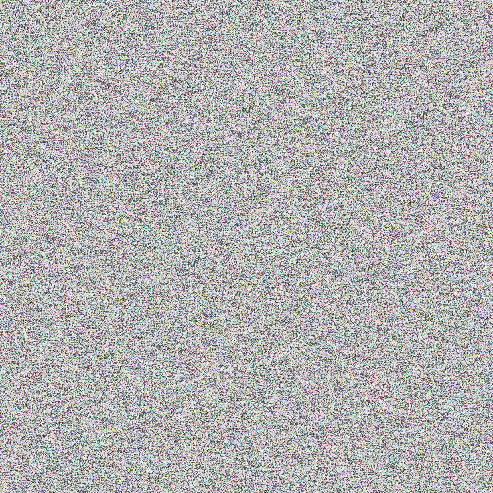

# 🖼️ json2png


> 🎨 Convert any JSON file into a unique PNG image — and back again.

Each character's raw UTF-8 byte value drives the pixel colors directly.
Every 3 bytes become one RGB pixel. Really tired of looking at JSON files? 😴
Get a fresh perspective with a little bit of color! ✨

## 🎭 Example

Here's what [5MB-min.json](https://microsoftedge.github.io/Demos/json-dummy-data/5MB-min.json) looks like as a PNG:



## 🚀 Features

- 🔒 **Deterministic output** — identical JSON always produces the exact same PNG (keys are sorted, whitespace is stripped)
- 🧬 **Direct byte-to-pixel mapping** — each UTF-8 byte maps to an R, G, or B channel value, so the image is a true visual fingerprint of the data
- 💡 **Brightness boost via bit-shift** — left-shifts each byte to push ASCII's narrow 32–126 range into vivid, full-spectrum colors (configurable, default 1 bit)
- 🔄 **Reversible** — `png2json.py` decodes a PNG back into the original JSON (lossless for ASCII content at any shift; use `--shift 0` for Unicode)
- 📐 **Exact sizing** — the image contains only the pixels the JSON data produces, no padding or tiling
- 🟩 **Square-ish dimensions** — the output dimensions are chosen to be as close to square as possible while fitting the pixel count exactly
- 📁 **Custom output path** — specify an output file with `-o`, or let it default to `<input>.png` / `<input>.json`

## 🛠️ Setup

```bash
python3 -m venv .venv
source .venv/bin/activate
pip install -r requirements.txt
```

## 📖 Usage

### json2png — encode

```bash
# basic — writes sample.png next to the input
python json2png.py sample.json

# custom output path
python json2png.py data.json -o artwork.png

# original (dim) colors — no bit-shift
python json2png.py data.json --shift 0

# extra bright (shift left by 2 → ×4)
python json2png.py data.json --shift 2
```

| Flag | Description | Default |
|------|-------------|---------|
| `-o, --output` | Output PNG path | `<input>.png` |
| `--shift` | Left-shift bits to brighten colors (0 = off) | `1` |

### png2json — decode

```bash
# basic — writes artwork.json next to the input
python png2json.py artwork.png

# custom output path
python png2json.py artwork.png -o restored.json

# must match the shift used during encoding
python png2json.py artwork.png --shift 2

# compact output (no indentation)
python png2json.py artwork.png --indent 0
```

| Flag | Description | Default |
|------|-------------|---------|
| `-o, --output` | Output JSON path | `<input>.json` |
| `--shift` | Right-shift to reverse brightness (must match encode shift) | `1` |
| `--indent` | JSON indentation level (0 = compact) | `2` |
